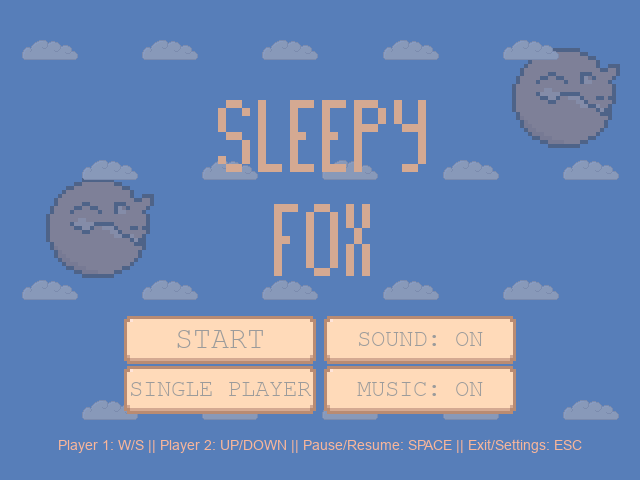
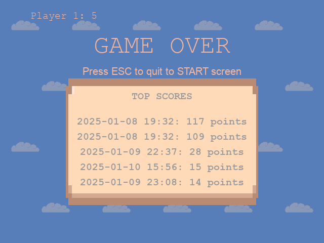

# 🦊 Sleepy Fox

Sleepy Fox is my interpretation of the classic Pong game. This is my third game ever.

## Current Progress
[▓▓▓▓▓▓▓▓░░] 88%

- [x] Project setup (deadline: 29.12.2024) - _completed on 29.12.2024_
- [x] Asset creation (deadline: 2.01.2025) - _completed on 29.12.2024_
- [x] Core gameplay (deadline: 9.01.2025) - _completed on 3.01.2024_
- [x] Game logic (deadline: 16.01.2025) - _completed on 6.01.2025_
- [x] User interface development (deadline: 21.01.2025) - _completed on 8.01.2025_
- [x] Testing and debugging (deadline: 25.01.2025) - _completed on 10.01.2025_
- [ ] Documentation (deadline: 27.01.2025)
- [ ] Release (deadline: 29.01.2025)


## 📑 Table of Contents
- [Quick Start (Just Play)](#-quick-start-just-play)
- [Development Setup](#-development-setup)
  - [Prerequisites](#prerequisites)
  - [Step-by-Step Installation](#step-by-step-installation)
  - [Running the Game](#running-the-game)
  - [Controls](#controls)
- [Project Goals](#-project-goals)
- [Features](#-features)
- [Documentation](#-documentation)
- [What I Learned](#-what-i-learned)
- [First Time Achievements](#-first-time-achievements)
- [Screenshots](#-screenshots)
- [Demo](#-demo)
- [Technical Details](#-technical-details)

## 🎮 Quick Start (Just Play)
Download the game:
- **macOS**: Download `SleepyFox.zip` from [Releases]()
  - After downloading, locate SleepyFox.app in Finder. 
  - When opening for the first time:
    - Right-click (or Control-click) on the app and select Open. 
    - In the pop-up dialog, confirm by clicking Open. 
    - This step is necessary because the app is not notarized by Apple. (_and I'm too poor to pay for it_ 😅)
    - Note: First launch might take a few seconds.
  - Afterward, you can open the app normally by double-clicking.
- **Windows**: Download `SleepyFox.zip` from [Releases]()
  - After downloading, extract the contents of the zip file.
  - Locate and run `SleepyFox.exe`.
  - When downloading the game, your antivirus might flag it as suspicious. This is a "false positive" - the game is completely safe! This happens because the game is packaged with PyInstaller, which bundles Python and all dependencies into a single executable file.
  - If this happens, you can:
    - Add the game to your antivirus whitelist/exceptions
    - Temporarily disable your antivirus while installing
    - Use the source code version instead (follow the Development Setup instructions)

## 🚀 Development Setup
If you want to explore or modify the code:

### Prerequisites
- Python 3.12 or higher
- pip (Python package installer)
- PyGame 2.6.1

To verify your Python installation:
```bash
python --version
pip --version
```

### Step-by-Step Installation
1. Clone the repository:
   ```bash
   git clone https://github.com/aysieelf/Sleepy-Fox.git
   cd Sleepy-Fox
   ```

2. Create and activate a virtual environment (recommended):
   ```bash
   # On Windows
   python -m venv .venv
   .venv\Scripts\activate

   # On macOS/Linux
   python -m venv .venv
   source .venv/bin/activate
   ```

3. Install the required dependencies:
   ```bash
   pip install -r requirements.txt
   ```

### Running the Game
```bash
python main.py
```

### Controls
  - Player 1 (Left Cloud): `W` `S`
  - Player 2 (Right Cloud): `↑` `↓`
  - Pause/Resume: `Space`
  - Return to Menu: `Esc`

- **Menu Navigation**
  - Select: `↑` `↓`
  - Confirm: `Enter`
  - Back: `Esc`

## 🎯 Project Goals
- Create a simple Pong game with a twist
- Try out sprite animations
- Try out sound effects
- Try out basic AI for single-player mode
- Implement a scoring system
- Implement a game over screen
- Implement a main menu screen
- Implement a pause screen
- Implement a settings screen

## 🚀 Features
- Single-player and two-player modes
- AI opponent for single-player mode
- Customizable game settings for sound and music
- Main menu screen
- Pause screen
- Game over screen with leaderboard
- Background music and sound effects
- Scoring system
- Level progression
- Bonus stars for extra points

## 📚 Documentation
- [User Guide](docs/user-guide.md) - Detailed instructions on how to play the game

## 📚 What I Learned
- pygame.image.load() can be used to load images from files - better to be used with convert() for better performance
- convert_alpha() can be used to load images with transparency
- When I want to create a sprite, I inherit pygame.sprite.Sprite and use the constructor to set the image and rect attributes
- Using a sprite group to manage multiple sprites is more efficient than managing them individually
  - it's better for collision detection
  - it's better for rendering
  - I can use sprite groups to update and draw all sprites in the group at once
- Velocity can be used to control the speed and direction of a sprite
- pygame.transform.rotate() can be used to rotate an image
- pygame.key.get_pressed() can be used to check if a key is being held down
- VSync synchronizes the frame rate with the monitor's refresh rate
   - When using Vsync, set clock.tick() to 0 to avoid conflicts
   - Vsync in included in the SCALED flag, just set it to vsync=1
- Collision resolution can be done by checking if two rectangles overlap
- pygame.mixer.Sound() is used for sounds (better in wav)
- pygame.mixer.music.load() is used for background music (better in mp3)
  - pygame.mixer.music.play(-1) loops indefinitely
- It's a good idea to use Enum class for game states

## 💡 First Time Achievements
- First time drawing my own sprites
- First time using sound effects
- First time using sprite groups
- First time using velocity for sprite movement
- First time using sprite rotation
- First time using a hitbox for collision detection
- First time using an AI for a game
- Finally, I found how fix my choppy animations: just use SCALED with vsync=1
- First time using collision resolution
- First time using velocity management system
- First time using sound manager system

## 📸 Screenshots





## 🎥 Demo


## 🛠️ Technical Details
- Python version: 3.12
- PyGame version: 2.6.1
- Development Platform: PyCharm
- Resolution: 640x480 pixels

---
Part of my [Game Development Journey](https://github.com/aysieelf/Game-Dev-Journey) 🎮
